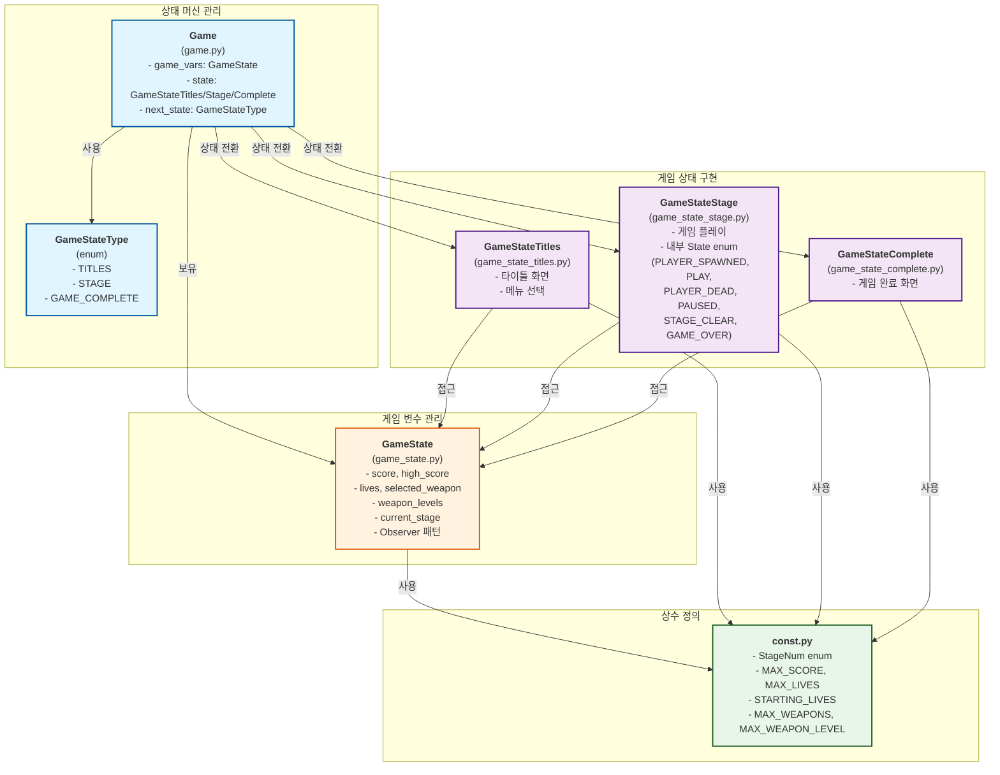

# 상태 관리 파일 관계도

## 파일별 역할

### 1. `game.py` - 상태 머신 관리자
- **Game 클래스**: 게임의 전체 흐름 관리
- **GameStateType enum**: 상태 타입 정의
- `game_vars`: `GameState` 인스턴스 보유
- `state`: 현재 활성 상태 (`GameStateTitles`, `GameStateStage`, `GameStateComplete`)
- 상태 전환 메서드: `go_to_titles()`, `go_to_new_game()`, `go_to_continue()`, `go_to_game_complete()`, `go_to_next_stage()`

### 2. `game_state.py` - 게임 변수 저장소
- **GameState 클래스**: 게임의 영구적 변수 관리
- 점수, 생명, 무기 레벨, 스테이지 등 저장
- Observer 패턴으로 상태 변경 알림
- `const.py`의 상수 사용

### 3. `game_state_titles.py` - 타이틀 화면 상태
- 타이틀 화면 로직
- `game.game_vars`를 통해 `GameState` 접근
- 메뉴 선택 처리

### 4. `game_state_stage.py` - 게임 플레이 상태
- 게임 플레이 로직
- 내부 `State` enum으로 세부 상태 관리
- `game.game_vars`를 통해 `GameState` 접근 및 수정

### 5. `game_state_complete.py` - 게임 완료 상태
- 게임 완료 화면 로직
- `game.game_vars`를 통해 최종 점수 표시

### 6. `const.py` - 상수 정의
- `StageNum` enum: 스테이지 번호
- 게임 설정 상수들 (최대 점수, 생명, 무기 등)

## 데이터 흐름

1. **초기화**: `Game` → `GameState` 생성 → `GameStateTitles` 시작
2. **게임 시작**: `Game.go_to_new_game()` → `GameState.new_game()` → `GameStateStage`로 전환
3. **상태 변경**: 각 상태에서 `game.game_vars`를 통해 `GameState` 읽기/쓰기
4. **스테이지 진행**: `Game.go_to_next_stage()` → `GameState.go_to_next_stage()` → `GameStateStage` 재생성
5. **게임 완료**: 모든 스테이지 완료 → `GameStateComplete`로 전환

